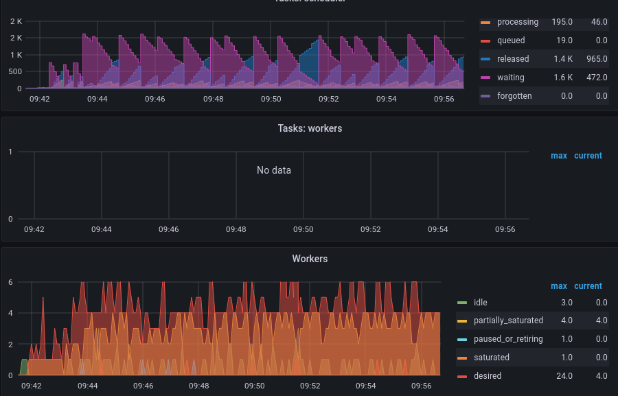

# DASK P2P Shuffle Instability Example

The goal of this example is reproduce a scenario where the dask operator together with P2P shuffling causes restarts and undeterministic runtime behavior.

## Remarks

- Computation makes no sense and is only there to generate some load
- Depending on the CPU speed one needs to either modify the load or lower the CPU limits to hit the spot where instabilities occur

## Usage

1. Use `deploy.sh` to deploy a simple adaptive cluster to microk8s
 (or modify it to deploy it to a cluster of your choice)

2. Create a venv eg.: `python -m venv venv && venv/bin/pip install -r requirements.txt`

3. Run the client script `source venv/bin/activate && python main.py`

4. monitor the worker count & runtime

## Example run in grafana

